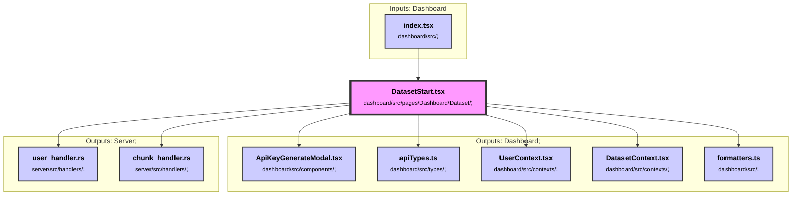

# index.tsx

chat/src/index.tsx

### Purpose
This file serves as the entry point for a Solid.js application. It initializes error tracking with Sentry in production environments and renders the main `Chat` component within a user context wrapper.

### Flow
1. **Imports**: The file imports necessary styles, libraries, and components.
2. **Sentry Initialization**: If the application is not in development mode (`!DEV`), Sentry is configured with a DSN and various integrations for error tracking and session replay.
3. **Rendering**: The `Chat` component is wrapped with `UserContextWrapper` and rendered into the DOM element with the id `root`.

##### Auto generated documentation file from CodeViz.ai