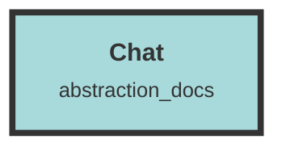

# Chat

## Core Functionality
- **Chat Interface Management**:
  - `chat.tsx`: Manages the main chat interface, including fetching and displaying topics, and handling sidebar and main content interactions.
  - `MainLayout.tsx`: Manages message input, streaming, and topic management within the chat interface.
  - `AfMessage.tsx`: Displays and manages individual messages within the chat interface.

- **User Context and State Management**:
  - `UserContext.tsx`: Provides a centralized store for user information, organizations, datasets, and authentication actions.
  - `apiTypes.ts`: Defines TypeScript interfaces and type guards for handling various data entities.
  - `messages.ts`: Defines TypeScript interfaces and utility functions for handling `Message` objects.

- **UI Components**:
  - `Navbar.tsx`: Provides a navigation bar with functionality to toggle the sidebar, display the current topic, and create new topics.
  - `Sidebar.tsx`: Manages topics within a dashboard, allowing users to create, edit, delete, and select topics.
  - `FullScreenModal.tsx`: Creates a full-screen modal dialog for displaying content in a modal overlay.
  - `Tooltip.tsx`: Displays additional information when a user hovers over an element.
  - `DatasetSelectBox.tsx`: Provides a UI element for selecting a dataset from a list.
  - `OrganizationSelectBox.tsx`: Allows users to select an organization from a dropdown menu.
  - `ShowToast.tsx`: Defines a toast notification system for displaying success or error messages.
  - `ScoreChunk.tsx`: Displays a chunk of metadata with various attributes and functionalities.
  - `InputRowsForm.tsx`: Creates a form with multiple input fields for handling various types of inputs.

- **Theme Management**:
  - `OnScreenThemeModeController.tsx`: Manages and toggles between light and dark themes.
  - `ThemeModeController.tsx`: Allows users to toggle between light, dark, and system theme modes.

- **Utility Functions**:
  - `formatters.ts`: Provides utility functions for formatting numbers and byte sizes.
  - `actix-api.ts`: Defines interfaces and utility functions for handling referral tokens, Stripe checkout sessions, and user plans.

- **Service Worker**:
  - `sw.js`: A Service Worker script that handles the `install`, `activate`, and `fetch` events, though it currently does not perform any actions.

- **Entry Point**:
  - `index.tsx`: Initializes error tracking with Sentry and renders the main `Chat` component within a user context wrapper.