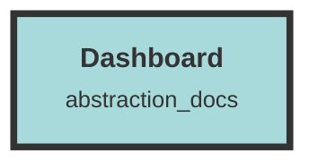

# Dataset Management Dashboard

## Core Functionality
- **Dataset Management**:
  - `DatasetStart.tsx`: Interface for managing datasets and API keys.
  - `DatasetSettingsPage.tsx`: Forms for configuring dataset settings.
  - `DatasetOverview.tsx`: Interface for viewing, creating, and deleting datasets.
  - `DatasetEvents.tsx`: Fetch and display dataset-related events.
  - `NewDatasetModal.tsx`: Modal for creating new datasets.

- **User and Organization Management**:
  - `UserContext.tsx`: Manages user authentication and organization selection.
  - `UserManagement.tsx`: Manages users and invitations within an organization.
  - `InviteUserModal.tsx`: Modal for inviting new users.
  - `EditUserModal.tsx`: Modal for editing user roles.
  - `CreateNewOrgModal.tsx`: Modal for creating new organizations.
  - `Settings.tsx`: Forms for updating and deleting organization details.

- **API Key Management**:
  - `ApiKeyGenerateModal.tsx`: Interface for generating new API keys.
  - `DatasetStart.tsx`: Manages API keys, including viewing and deleting keys.

- **Context Management**:
  - `DatasetContext.tsx`: Provides dataset information to components.
  - `ContextWrapper.tsx`: Wraps components with user and dataset contexts.

- **Layout and Navigation**:
  - `DashboardLayout.tsx`: Main layout for the dashboard.
  - `DatasetLayout.tsx`: Layout wrapper for dataset-related pages.
  - `Navbar.tsx`: Navigation bar for the application.
  - `Sidebar.tsx`: Navigational sidebar for the dashboard.
  - `OrgTabs.tsx`: Navigation tabs for organization sections.
  - `DatasetTabs.tsx`: Navigation tabs for dataset sections.

- **Utility and Formatting**:
  - `formatters.ts`: Utility functions for formatting numbers, bytes, and dates.
  - `ShowToasts.tsx`: Mechanism for displaying toast notifications.

- **Billing and Subscription Management**:
  - `Billing.tsx`: Manages and displays billing information.
  - `PlansTable.tsx`: Displays and manages subscription plans.

- **Home and Overview Pages**:
  - `Home.tsx`: Handles user authentication and redirects.
  - `Overview.tsx`: Comprehensive view of the user's organization, including datasets and usage statistics.

- **Type Definitions**:
  - `apiTypes.ts`: Defines TypeScript interfaces and utility functions for managing users, organizations, datasets, and related entities.
