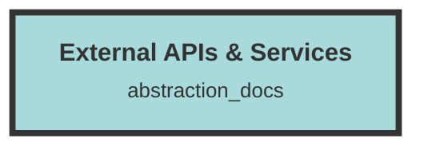

# External APIs & Services

## Core Functionality
- **Natural Language Processing (OpenAI)**
  - Generate text embeddings and chat completions using OpenAI's API.
  - Example Files: `model_operator.rs`, `message_handler.rs`, `chunk_handler.rs`, `NewDatasetModal.tsx`.

- **Subscription Management (Stripe)**
  - Handle subscription plans, payments, and limits using Stripe's API.
  - Example Files: `stripe_handler.rs`, `dataset_handler.rs`, `PlansTable.tsx`, `organization_operator.rs`.

- **Email Communication (SMTP)**
  - Send emails for notifications and invitations using an SMTP server.
  - Example Files: `email_operator.rs`.

- **Error Tracking and Performance Monitoring (Sentry)**
  - Capture errors and monitor performance across the application.
  - Example Files: `chunk_operator.rs`, `group_operator.rs`, `file_handler.rs`, `lib.rs`.

- **Vector Search (Qdrant)**
  - Manage and query vector embeddings for data chunks using Qdrant.
  - Example Files: `chunk_operator.rs`, `group_operator.rs`, `qdrant_operator.rs`, `search_operator.rs`.

- **File Storage and Retrieval (AWS)**
  - Handle file uploads, downloads, and deletions using Amazon S3.
  - Example Files: `file_handler.rs`, `file-worker.rs`, `file_operator.rs`.

- **Content Analysis (Tika)**
  - Convert file data to HTML format for consistent processing.
  - Example Files: `file-worker.rs`.

Each service is integrated through specific files that handle API interactions, data processing, and error management, ensuring seamless functionality within the broader codebase.