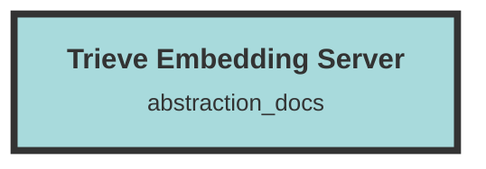

# Trieve Embedding Server

## Core Functionality
- **Embedding Generation**:
  - `main.py`: Sets up a FastAPI application to generate embeddings using a pre-trained model from the Hugging Face Transformers library.
