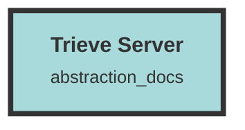

# Server

## Core Functionality
- **Organization Management**: 
  - `organization_operator.rs`: Handles creating, updating, deleting, and retrieving organizations and their associated data.
  - `invitation_operator.rs`: Manages invitations within an organization.
  - `organization_handler.rs`: Defines API endpoints for managing organizations.

- **File Processing**:
  - `file-worker.rs`: Initializes and runs a file worker service to process files from a Redis queue and upload them to an S3 bucket.
  - `file_operator.rs`: Handles operations related to files, such as creating, retrieving, and deleting files.
  - `file_handler.rs`: Manages file-related operations like uploading, downloading, and deleting files.

- **Embedding Creation**:
  - `model_operator.rs`: Contains functions for creating and retrieving embeddings from various embedding servers.
  - `parse_operator.rs`: Processes HTML content, chunks text documents, and averages embeddings.

- **HTML Parsing and Chunk Management**:
  - `chunk_operator.rs`: Manages chunk metadata operations in a database.
  - `chunk_handler.rs`: Defines data structures and API endpoints for managing and interacting with chunks of data.

- **Error Handling**:
  - `errors.rs`: Defines a structured way to handle and respond to various service errors using the Actix-web framework.

- **Search and Recommendation**:
  - `search_operator.rs`: Handles search operations over chunks and groups of data, integrating with Qdrant for vector-based searches.
  - `qdrant_operator.rs`: Interacts with a Qdrant vector database for managing collections, upserting points, and performing searches.

- **User and Authentication Management**:
  - `user_operator.rs`: Manages users, organizations, and API keys.
  - `auth_handler.rs`: Handles authentication and authorization processes.
  - `auth_middleware.rs`: Implements authentication middleware for the Actix web application.

- **Dataset Management**:
  - `dataset_operator.rs`: Manages datasets within a web service.
  - `dataset_handler.rs`: Defines API endpoints for managing datasets.

- **Event Handling**:
  - `event_operator.rs`: Handles database operations related to events.
  - `event_handler.rs`: Defines an API endpoint for retrieving events related to a specific dataset.

- **Messaging and Chat**:
  - `message_operator.rs`: Manages messages and topics within a chat application.
  - `message_handler.rs`: Implements handlers for managing messages in a chat system.

- **Stripe Integration**:
  - `stripe_operator.rs`: Interacts with Stripe for managing subscriptions and plans.
  - `stripe_handler.rs`: Handles various Stripe-related operations such as webhook processing and payment link generation.

- **Miscellaneous**:
  - `randutil.rs`: Generates a random organization name.
  - `fix_tag_set.py`: Updates the `tag_set` column in the database tables.
  - `redoc_ci.rs`: Generates and prints a JSON representation of the OpenAPI documentation.
  - `create-new-qdrant.rs`: Manages a Qdrant collection by deleting an existing field index and creating a new collection query.
  - `build.rs`: Manages environment variables for the build process.
  - `main.rs`: Serves as the entry point for the Rust application.
  - `lib.rs`: Configures and runs the web server application.
  - `models.rs`: Defines data structures and their associated methods for managing and manipulating metadata within a database.
  - `mod.rs`: Serves as module declarations for organizing the project.