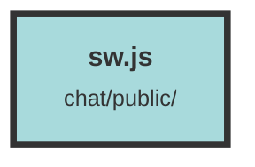

# sw.js

### Purpose
This file is a Service Worker script designed to handle the `install`, `activate`, and `fetch` events. However, in its current state, it does not perform any actions during these events.

### Flow
1. **Install Event**: The script listens for the `install` event but does not execute any code when this event occurs.
2. **Activate Event**: Similarly, it listens for the `activate` event without performing any actions.
3. **Fetch Event**: The script also listens for the `fetch` event but does not handle any network requests or responses.

Each event listener is set up to comply with the Service Worker lifecycle but is intentionally left empty.

##### Auto generated documentation file from CodeViz.ai
