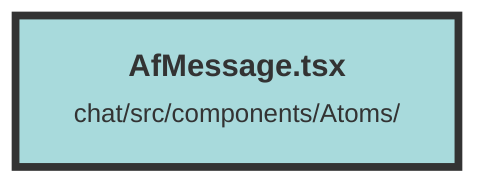

# AfMessage.tsx


### Purpose
The `AfMessage` component is designed to display and manage messages within a chat interface. It handles different roles (user, assistant, system) and provides functionalities for editing messages, displaying metadata, and sanitizing HTML content.

### Flow
1. **Imports and Interface Definition**:
   - Imports necessary icons, hooks, and utilities.
   - Defines the `AfMessageProps` interface to specify the expected properties.

2. **State Initialization**:
   - Initializes several state signals using `createSignal` to manage editing states, content, and metadata.

3. **Effects and Memoization**:
   - `createEffect` to update `editingMessageContent` when `props.content` changes.
   - `displayMessage` memo to process and format the message content based on the role and order.

4. **Message Display Logic**:
   - Handles different roles and formats the message content accordingly.
   - If the message is too long or from the assistant, it processes and displays metadata.

5. **Editing Functionality**:
   - Provides a textarea for editing messages with auto-resize functionality.
   - Includes buttons to save or cancel edits.

6. **Rendering**:
   - Uses conditional rendering (`<Show>`) to display different UI elements based on the state.
   - Displays user or assistant icons, message content, and metadata.
   - Shows an edit button for user messages and handles mouse events to toggle its visibility.

7. **Metadata Handling**:
   - Processes and displays metadata chunks associated with the message.
   - Uses a `For` loop to render `ScoreChunk` components for each metadata chunk.

8. **Sanitization**:
   - Sanitizes HTML content before rendering to ensure safe display of messages.
```

##### Auto generated documentation file from CodeViz.ai
