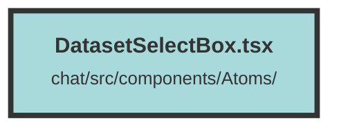

# DatasetSelectBox.tsx

### Purpose
The `DatasetSelectBox` component provides a user interface element for selecting a dataset from a list of available datasets. It displays the current dataset and allows users to switch between different datasets.

### Flow
1. **Context Usage**: The component uses the `UserContext` to access datasets and the current dataset.
2. **Conditional Rendering**: It conditionally renders the component only if there are datasets available (`userContext.datasetsAndUsages?.()?.length != 0`).
3. **Popover Component**: Utilizes the `Popover` component from the `terracotta` library to create a dropdown menu.
4. **Popover Button**: The `PopoverButton` toggles the visibility of the dropdown menu and displays the name of the current dataset.
5. **Menu and MenuItem**: Inside the `PopoverPanel`, a `Menu` is rendered with `MenuItem` components for each dataset. Clicking a `MenuItem` sets the current dataset and closes the dropdown.
6. **Icon Indication**: The `FaSolidCheck` icon indicates the currently selected dataset.

##### Auto generated documentation file from CodeViz.ai
