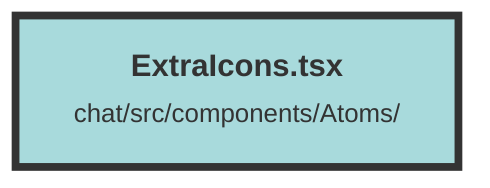

# ExtraIcons.tsx

### Purpose
The `TrieveLogo` component is a React functional component designed to display the Trieve logo.

### Flow
The component returns an `` element with the `src` attribute pointing to the URL of the Trieve logo image. The `alt` attribute is left empty. This component can be used to easily include the Trieve logo in any part of a React application.

##### Auto generated documentation file from CodeViz.ai
