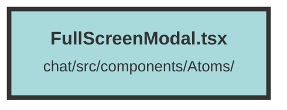

# FullScreenModal.tsx

### Purpose
The `FullScreenModal` component is designed to create a full-screen modal dialog in a Solid.js application. It provides a flexible and reusable way to display content in a modal overlay, which can be controlled via its open state.

### Flow
1. **Imports**: The component imports necessary modules from `terracotta` and `solid-js`.
2. **Props Interface**: Defines `FullScreenModalProps` with `children`, `isOpen`, and `setIsOpen`.
3. **Component Definition**: The `FullScreenModal` component:
   - Uses the `Show` component to conditionally render the modal based on `isOpen`.
   - Renders a `Dialog` component with classes for styling and an `onClose` handler to set `isOpen` to `false`.
   - Inside the `Dialog`, it includes:
     - A `DialogOverlay` for the background.
     - A `span` for alignment.
     - A `DialogPanel` to display the `children` content with specific styling.

##### Auto generated documentation file from CodeViz.ai
