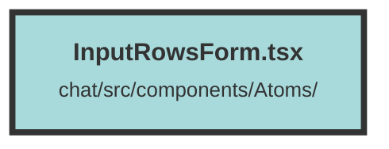

# InputRowsForm.tsx

### Purpose
The `InputRowsForm` component is designed to create a form with multiple input fields, each defined by an `InputGroup`. It provides a flexible way to handle various types of inputs, including text inputs, textareas, and custom components. The form also includes "Create" and "Cancel" buttons to handle form submission and cancellation.

### Flow
1. **Component Definition**: The `InputRowsForm` component is defined with properties specified in the `InputRowsFormProps` interface.
2. **Rendering Input Groups**: The component iterates over the `inputGroups` array using the `For` directive. For each `InputGroup`:
   - It displays the label.
   - Depending on the `type` property, it renders either an `<input>` or `<textarea>` element.
   - If a custom component is provided, it renders that component instead.
3. **Input Handling**: The `onInput` event updates the input value using the `setInputValue` function if provided.
4. **Buttons**: The "Cancel" and "Create" buttons are rendered at the bottom of the form. The `onCancel` and `onCreate` functions are called when these buttons are clicked, respectively.
5. **Styling**: The component uses various CSS classes to style the form elements, ensuring a consistent look and feel across different themes (light and dark).

##### Auto generated documentation file from CodeViz.ai
