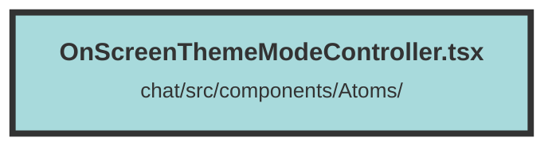

# OnScreenThemeModeController.tsx

### Purpose
This file provides functionality to manage and toggle between light and dark themes for a web application. It includes functions to set, get, and clear the theme mode, as well as a UI component to control the theme mode on the screen.

### Flow
1. **Imports**: The file imports necessary icons from `solid-icons/bi` and the `createSignal` function from `solid-js`.

2. **setThemeMode**: This function sets the theme mode to either "light" or "dark". It updates the `document.documentElement` class and stores the mode in `localStorage`.

3. **getThemeMode**: This function retrieves the current theme mode from `localStorage`. If no mode is set, it defaults to "system".

4. **clearThemeMode**: This function removes the theme mode from `localStorage` and sets the theme based on the user's system preference.

5. **OnScreenThemeModeController**: This is a UI component that allows users to toggle between light and dark themes. It uses `createSignal` to manage the current theme mode state. The component includes buttons with icons that change appearance based on the current theme mode. The buttons call `setThemeMode` and `clearThemeMode` to update the theme and the state accordingly.

##### Auto generated documentation file from CodeViz.ai
