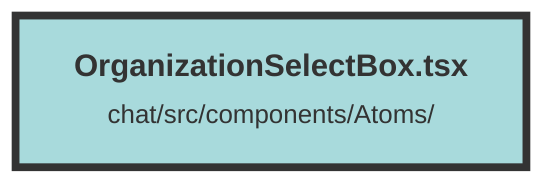

# OrganizationSelectBox.tsx


### Purpose
The `OrganizationSelectBox` component allows users to select an organization from a dropdown menu. It displays the current organization and provides a list of available organizations for selection.

### Flow
1. **Context Initialization**: The component uses the `UserContext` to access the current organization and the list of available organizations.
   ```javascript
   const userContext = useContext(UserContext);
   ```

2. **Popover Setup**: A `Popover` component is used to create a dropdown menu that toggles visibility when the button is clicked.
   ```javascript
   <Popover defaultOpen={false} class="relative">
   ```

3. **Button Display**: The `PopoverButton` displays the name of the current organization and an icon.
   ```javascript
   <PopoverButton aria-label="Toggle filters" type="button" class="flex items-center space-x-1 pb-1 text-sm">
     <span class="line-clamp-1 text-left text-sm">
       {userContext.currentOrganization?.()?.name}
     </span>
     <svg ...>...</svg>
   </PopoverButton>
   ```

4. **Dropdown Menu**: When the popover is open, a `PopoverPanel` containing a `Menu` is displayed. The menu lists all organizations.
   ```javascript
   <Show when={isOpen()}>
     <PopoverPanel ...>
       <Menu class="mx-1 space-y-0.5">
         <For each={userContext.organizations?.()}>
           {(organizationItem) => {
             ...
           }}
         </For>
       </Menu>
     </PopoverPanel>
   </Show>
   ```

5. **Menu Items**: Each organization is rendered as a `MenuItem`. Clicking an item sets it as the current organization and closes the dropdown.
   ```javascript
   <MenuItem as="button" ... onClick={onClick}>
     <div class="flex flex-row justify-start space-x-2">
       <span class="line-clamp-1 text-left text-sm">
         {organizationItem.name}
       </span>
     </div>
     {organizationItem.id == userContext.currentOrganization?.()?.id && (
       <span>
         <FaSolidCheck class="text-sm" />
       </span>
     )}
   </MenuItem>
   ```

6. **State Management**: The `onClick` handler updates the current organization in the context and closes the popover.
   ```javascript
   const onClick = (e: Event) => {
     e.preventDefault();
     e.stopPropagation();
     userContext.setCurrentOrganization(organizationItem);
     setState(false);
   };
   ```

##### Auto generated documentation file from CodeViz.ai
