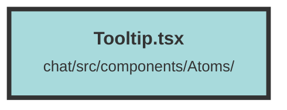

# Tooltip.tsx

### Purpose
The `Tooltip` component provides a way to display additional information when a user hovers over an element. It is designed to enhance user experience by offering contextual help or details without cluttering the UI.

### Flow
1. **Imports and Props Definition**:
   - Imports `Show` and `createSignal` from "solid-js".
   - Defines `TooltipProps` interface with `body` and `tooltipText`.

2. **Component Initialization**:
   - `Tooltip` component is defined, taking `TooltipProps` as input.
   - Uses `createSignal` to manage the visibility state (`show`) of the tooltip.

3. **Rendering**:
   - The component returns a `div` with a relative position.
   - Inside this `div`, another `div` is rendered which contains `props.body` and has event handlers for `onMouseEnter` and `onMouseLeave` to toggle the `show` state.

4. **Tooltip Display**:
   - Uses the `Show` component to conditionally render the tooltip based on the `show` state.
   - The tooltip is an absolutely positioned `div` with styling for appearance and positioning.
   - An additional `div` is rendered to create a caret effect, enhancing the visual connection between the tooltip and the hovered element.

##### Auto generated documentation file from CodeViz.ai
