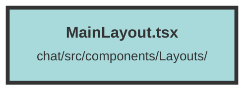

# MainLayout.tsx

### Purpose
The `MainLayout` component is designed to manage and display a chat interface where users can interact with an assistant. It handles message input, message streaming, and topic management, providing a seamless user experience for chat-based applications.

### Flow
1. **Imports and Context Setup**:
   - Imports necessary Solid.js hooks, icons, and custom components.
   - Retrieves user context using `useContext(UserContext)`.

2. **State Management**:
   - Uses `createSignal` to manage various states like messages, new message content, streaming status, etc.

3. **Effects**:
   - `createEffect` to handle auto-scroll behavior based on user interactions.
   - Another `createEffect` to fetch messages when a new topic is selected.

4. **Helper Functions**:
   - `scrollToBottomOfMessages`: Scrolls the chat to the latest message.
   - `resizeTextarea`: Adjusts the height of the textarea based on content.
   - `handleReader`: Reads and decodes streamed messages from the server.
   - `fetchCompletion`: Handles message submission and response streaming.
   - `fetchMessages`: Fetches messages for a given topic.

5. **Event Handlers**:
   - `submitNewMessage`: Submits a new message to the server.
   - Button click handlers for regenerating responses and stopping message generation.

6. **Render**:
   - Renders the chat interface with messages, input textarea, and control buttons.
   - Uses `For` to iterate over messages and display them using `AfMessage`.
   - Conditional rendering with `Show` and `Switch` for different states (e.g., streaming, not streaming).
   - Includes a modal for chat tuning parameters.

The component ensures smooth interaction by managing state and effects efficiently, providing a responsive and user-friendly chat interface.

##### Auto generated documentation file from CodeViz.ai
