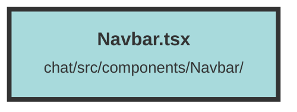

# Navbar.tsx

### Purpose
The `Navbar` component is designed to provide a navigation bar for a web application. It includes functionality to toggle a sidebar, display the current topic, and initiate the creation of a new topic.

### Flow
1. **Imports**: The component imports necessary icons and utilities from external libraries and local files.
2. **Props Interface**: Defines the `NavbarProps` interface, specifying the properties required by the `Navbar` component.
3. **Component Definition**: The `Navbar` component is defined as a functional component that takes `NavbarProps` as its properties.
4. **Main Container**: The main container is a `div` with styling classes for layout and appearance.
   - **Menu Icon**: A menu icon (`BiRegularMenuAltLeft`) is displayed on smaller screens. Clicking it toggles the sidebar's open state.
   - **Topic Display**: A `Switch` component conditionally renders either a loading message or the name of the selected topic.
   - **Plus Icon**: A plus icon (`BiRegularPlus`) is displayed on smaller screens. Clicking it initiates the creation of a new topic and logs the action to the console.

##### Auto generated documentation file from CodeViz.ai
