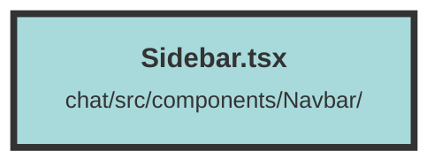

# Sidebar.tsx

### Purpose
The `Sidebar` component is designed to provide a user interface for managing topics within a dashboard. It allows users to create, edit, delete, and select topics, as well as access settings and other related functionalities.

### Flow
1. **Imports and Context**: The file imports various icons, hooks, and components from libraries like `solid-js` and custom components. It also uses the `UserContext` for user-related data.

2. **State Initialization**: Several state variables are initialized using `createSignal` to manage editing states, modal visibility, and star count.

3. **API Interactions**:
   - `submitEditText`: Sends a PUT request to update a topic's name.
   - `deleteSelected`: Sends a DELETE request to remove a selected topic.
   - `createEffect`: Fetches the star count from GitHub for display.

4. **UI Structure**:
   - **Topic Management**: Buttons and input fields for creating, editing, and deleting topics.
   - **Topic List**: Displays a list of topics with options to select and edit them.
   - **Footer**: Contains organization and dataset selectors, links to the dashboard, settings, and GitHub repository.

5. **Modals and Conditional Rendering**:
   - **Settings Modal**: Displays a modal for settings when `settingsModalOpen` is true.
   - **Sidebar Toggle**: Allows toggling the sidebar visibility on smaller screens.

The component uses various Solid.js features like `For`, `Show`, and `createEffect` to manage rendering and state updates efficiently.

##### Auto generated documentation file from CodeViz.ai
