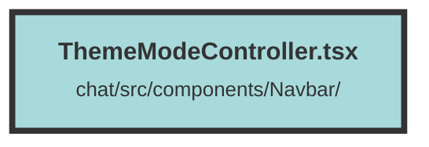

# ThemeModeController.tsx

### Purpose
The file defines a `ThemeModeController` component that allows users to toggle between light, dark, and system theme modes. It manages the theme state and updates the document's class and local storage accordingly.

### Flow
1. **Imports**: Necessary components and icons are imported from libraries.
2. **Theme Functions**:
   - `setThemeMode`: Sets the theme mode, updates the document class, and stores the mode in local storage.
   - `getThemeMode`: Retrieves the current theme mode from local storage or defaults to "system".
   - `clearThemeMode`: Clears the theme mode from local storage and sets the theme based on system preferences.
3. **ThemeModeController Component**:
   - Uses `createSignal` to manage the current theme state.
   - Renders a `Popover` containing a `PopoverButton` that toggles the theme menu.
   - The `PopoverPanel` contains a `Menu` with `MenuItem` options for light, dark, and system themes.
   - Each `MenuItem` updates the theme mode and the current theme state when clicked.

##### Auto generated documentation file from CodeViz.ai
