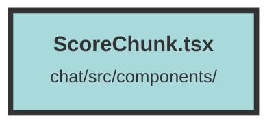

# ScoreChunk.tsx

### Purpose
The `ScoreChunk` component is designed to display a chunk of metadata with various attributes and functionalities. It provides a user interface for viewing, copying, and interacting with the chunk data, including links, tags, timestamps, and locations.

### Flow
1. **Imports and Setup**: The file imports necessary libraries and components, including Solid.js hooks, icons, and utility functions. It also sets up sanitizer options for HTML content.

2. **Helper Functions**:
   - `formatDate`: Formats a `Date` object into `MM/DD/YYYY`.
   - `getLocalTime`: Converts a UTC date string to local time.

3. **Component Props**: The `ScoreChunkProps` interface defines the expected properties for the `ScoreChunk` component, such as `chunkCollections`, `chunk`, `counter`, and more.

4. **Component Logic**:
   - **State Management**: Uses Solid.js signals to manage the state of `expanded` and `copied`.
   - **Copy Functionality**: `copyChunk` function copies the chunk's HTML content to the clipboard and provides feedback on success or failure.
   - **Expand Logic**: `useExpand` memo determines if the chunk content exceeds a certain length, enabling the "Show More" functionality.

5. **Rendering**:
   - **Header**: Displays the document counter, copy button, and link to open the chunk in a new tab.
   - **Metadata Display**: Iterates over `frontMatterVals` to conditionally render chunk metadata like links, tags, timestamps, and locations.
   - **Content Display**: Sanitizes and displays the chunk's HTML content, with conditional expansion based on the `expanded` state.
   - **Expand/Collapse Button**: Toggles the display of the full content with "Show More" and "Show Less" buttons.

6. **Export**: The `ScoreChunk` component is exported as the default export of the module.

##### Auto generated documentation file from CodeViz.ai
