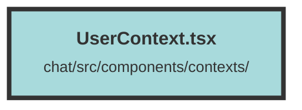

# UserContext.tsx

### Purpose
The purpose of this file is to create a user context for managing user-related state and actions within a Solid.js application. It provides a centralized store for user information, organizations, datasets, and authentication actions.

### Flow
1. **Imports and Interfaces**: The file imports necessary modules from Solid.js and defines interfaces for user context properties, notifications, and the user store.

2. **User Context Creation**: A `UserContext` is created using `createContext` with default values for user-related state and actions.

3. **UserContextWrapper Component**: This component initializes state signals for user, organizations, selected organization, current dataset, and datasets. It also defines the `login` function to authenticate the user and fetch user data.

4. **Effects**:
   - **User Organization Selection**: An effect ensures that an organization is selected if none is currently selected.
   - **Dataset Fetching**: Another effect fetches datasets for the selected organization.
   - **Login Effect**: An effect triggers the `login` function to authenticate the user on component mount.

5. **User Store**: A `userStore` object is created with state accessors and mutators, and the `login` and `logout` functions.

6. **Context Provider**: The `UserContext.Provider` is used to wrap the component's children, providing the `userStore` to the rest of the application.

##### Auto generated documentation file from CodeViz.ai
