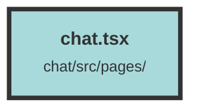

# chat.tsx

### Purpose
The `Chat` component is designed to manage and display a chat interface within the application. It handles the fetching and displaying of topics, as well as the layout and interaction of the sidebar and main content area.

### Flow
1. **Context and Signals Initialization**:
   - The component uses `useContext` to access the `UserContext`.
   - Several signals are created to manage state, including `selectedTopic`, `sidebarOpen`, `isCreatingTopic`, `topics`, `loadingNewTopic`, and `selectedNewTopic`.

2. **Fetching Topics**:
   - The `refetchTopics` function fetches topics from the API based on the current user's dataset.
   - It updates the state signals accordingly, setting `isCreatingTopic` and `selectedNewTopic` to `true`, and `selectedTopic` to `undefined`.

3. **Effect Hook**:
   - `createEffect` is used to call `refetchTopics` when the component is initialized.

4. **Component Layout**:
   - The component returns a `div` with a flex layout.
   - The sidebar is conditionally rendered based on the `sidebarOpen` signal.
   - The `Navbar` and `MainLayout` components are included, with relevant props passed to manage state and interactions.

5. **Sidebar and Main Content**:
   - The `Sidebar` component is responsible for displaying the list of topics and managing topic selection.
   - The `Navbar` component provides navigation and controls for creating new topics.
   - The `MainLayout` component displays the main content based on the selected topic and other state signals.

##### Auto generated documentation file from CodeViz.ai
