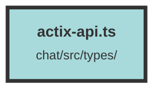

# actix-api.ts

### Purpose
This file defines TypeScript interfaces and utility functions for handling referral tokens, Stripe checkout sessions, and user plans. It ensures type safety and provides methods to interact with local storage and validate data structures.

### Flow
1. **Interfaces**:
   - `ActixApiDefaultError`: Represents a default error with a message.
   - `StripeCheckoutSessionResponse`: Represents a response containing a Stripe checkout session URL.
   - `UserPlan`: Represents a user's subscription plan details.

2. **Functions**:
   - `detectReferralToken(queryParamT: string | undefined)`: Checks if a referral token exists in local storage. If not, it adds the new token to the stored array.
   - `getReferralTokenArray()`: Retrieves the array of referral tokens from local storage.
   - `isStripeCheckoutSessionResponse(data: unknown)`: Type guard to check if the data is a `StripeCheckoutSessionResponse`.
   - `isUserPlan(data: unknown)`: Type guard to check if the data is a `UserPlan`.

These functions and interfaces help manage and validate data related to referral tokens, Stripe sessions, and user plans, ensuring consistency and type safety throughout the application.

##### Auto generated documentation file from CodeViz.ai
