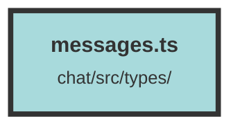

# messages.ts


### Purpose
This file defines a TypeScript interface and several utility functions for handling and validating `Message` objects and arrays of `Message` objects. It also includes a function to determine the role of a message based on its index.

### Flow
1. **Message Interface**: 
   ```typescript
   export interface Message {
     content: string;
   }
   ```
   - Defines a `Message` type with a single `content` property of type `string`.

2. **isMessage Function**: 
   ```typescript
   export const isMessage = (data: unknown): data is Message => {
     return typeof data === "object" && data !== null && "content" in data;
   };
   ```
   - Checks if a given `data` object conforms to the `Message` interface by verifying it is an object, not `null`, and contains a `content` property.

3. **isMessageArray Function**: 
   ```typescript
   export const isMessageArray = (data: unknown): data is Message[] => {
     return (
       Array.isArray(data) &&
       data.every((item) => {
         return isMessage(item);
       })
     );
   };
   ```
   - Validates if a given `data` is an array of `Message` objects by ensuring each item in the array passes the `isMessage` check.

4. **messageRoleFromIndex Function**: 
   ```typescript
   export const messageRoleFromIndex = (idx: number) => {
     if (idx == 0) {
       return "system";
     }
     if (idx % 2 == 0) {
       return "assistant";
     }
     return "user";
   };
   ```
   - Determines the role of a message based on its index:
     - Index `0` returns `"system"`.
     - Even indices return `"assistant"`.
     - Odd indices return `"user"`.

##### Auto generated documentation file from CodeViz.ai
