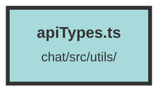

# apiTypes.ts

### Purpose
This file defines various TypeScript interfaces and type guards for handling metadata, user data, collections, notifications, and other related entities. It also includes utility functions for property checking and referral token management.

### Flow
1. **Interfaces and Types**:
   - `ChunkMetadata`, `ChunkMetadataWithVotes`, `ChunkCollectionDTO`, `SlimCollection`, `ChunkBookmarksDTO`, `ChunksWithTotalPagesDTO`, `ScoreChunkDTO`, `ActixApiDefaultError`, `ActixChunkUpdateError`, `OrganizationDTO`, `UserDTO`, `UserDTOWithVotesAndChunks`, `UsersWithTotalPagesDTO`, `UserDTOWithScore`, `ChunkCollectionPageDTO`, `ChunkCollectionBookmarkDTO`, `ChunkCollectionSearchDTO`, `BookmarkDTO`, `CreateChunkDTO`, `SingleChunkDTO`, `ChunkCollectionBookmarksDTO`, `ChunkCollectionBookmarksWithStatusDTO`, `FileDTO`, `FileUploadCompleteNotificationDTO`, `NotificationDTO`, `NotificationWithPagesDTO`, `Message`, `DatasetDTO`, `UsageDTO`, `DatasetAndUsageDTO`, `Topic`.

2. **Type Guards**:
   - Functions like `isChunkMetadata`, `isChunkMetadataWithVotes`, `isScoreChunkDTO`, `isActixApiDefaultError`, `isActixChunkUpdateError`, `isOrganizationDTO`, `isUserDTO`, `isUserDTOWithVotesAndChunks`, `isUserDTOWithScore`, `isChunkCollectionPageDTO`, `isChunkCollectionDTO`, `isChunkCollectionSearchDTO`, `isFileUploadCompleteNotificationDTO`, `isDatasetDTO`, `isUsageDTO`, `isDatasetAndUsageDTO` ensure that objects conform to the specified interfaces.

3. **Utility Functions**:
   - `indirectHasOwnProperty`: Checks if an object has a specific property.
   - `detectReferralToken`: Manages referral tokens in local storage.
   - `getReferralTokenArray`: Retrieves referral tokens from local storage.
   - `messageRoleFromIndex`: Determines the role of a message based on its index.

##### Auto generated documentation file from CodeViz.ai
