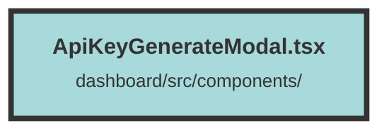

# ApiKeyGenerateModal.tsx

### Purpose
The `ApiKeyGenerateModal` component is designed to provide a user interface for generating a new API key. It allows users to input a name and select a role for the API key, then generates the key through an API call.

### Flow
1. **Initialization**: The component initializes several state variables using Solid.js's `createSignal` for managing the API key, name, role, and generation status.
2. **Context**: It retrieves the user context using `useContext` to access user-related information.
3. **API Key Generation**: The `generateApiKey` function sends a POST request to the API endpoint to generate a new API key. If successful, it updates the `apiKey` state and sets `generated` to true. If it fails, it shows an error toast.
4. **Effect Hook**: A `createEffect` hook resets the form fields and state variables whenever the modal is opened.
5. **Current User Role**: A `createMemo` computes the current user's role based on the selected organization.
6. **UI Rendering**: The component uses the `Show` component to conditionally render the modal. It displays a form for inputting the API key name and selecting the role when the key is not generated. Once the key is generated, it shows the generated key and a success message.
7. **Form Submission**: The form submission triggers the `generateApiKey` function, and the modal can be closed using the cancel button or the close icon.

##### Auto generated documentation file from CodeViz.ai
