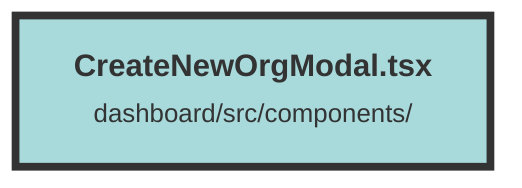

# CreateNewOrgModal.tsx

### Purpose
The `NewOrgModal` component provides a user interface for creating a new organization. It includes a modal dialog that allows users to input the name of the new organization and submit the form to create it.

### Flow
1. **Imports and Context Setup**: The component imports necessary libraries and context, including Solid.js hooks, UI components from "terracotta", and custom utilities like `createToast` and `UserContext`.

2. **Component Props**: The `NewOrgModal` component accepts `isOpen` (a boolean accessor to control modal visibility) and `closeModal` (a function to close the modal).

3. **State Management**: The component uses `createSignal` to manage the state of the organization name.

4. **API Interaction**: The `createDataset` function sends a POST request to the API to create a new organization. It handles success and error responses by displaying appropriate toast notifications and navigating to the new organization's dashboard.

5. **Modal Structure**: The modal is rendered using `Transition` and `Dialog` components. It includes:
   - A title and description.
   - An input field for the organization name.
   - Cancel and submit buttons.

6. **Form Submission**: On form submission, the `createDataset` function is called to handle the creation process.

7. **UI Feedback**: Toast notifications provide feedback on the success or failure of the organization creation process.

##### Auto generated documentation file from CodeViz.ai
