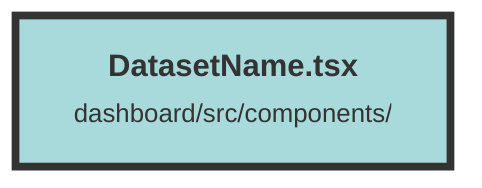

# DatasetName.tsx

### Purpose
The purpose of this file is to define a React component named `DatasetName` that displays the name of the current dataset from the `DatasetContext`.

### Flow
1. **Import Statements**: The file imports `createMemo` and `useContext` from the `solid-js` library and `DatasetContext` from a local context file.
2. **Context Usage**: The `DatasetName` component uses `useContext` to access the `DatasetContext`.
3. **Memoization**: The `curDatasetName` memo is created to compute the dataset name efficiently. It checks if a dataset exists and returns its name; otherwise, it returns `null`.
4. **Rendering**: The component returns an `h3` element with the dataset name followed by the word "Dataset". The text is styled with specific classes for size, weight, and color.

##### Auto generated documentation file from CodeViz.ai
