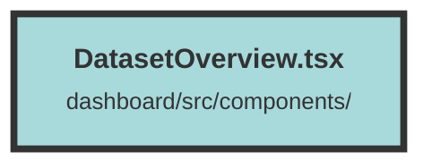

# DatasetOverview.tsx

### Purpose
The `DatasetOverview` component provides an interface for managing datasets. It allows users to view, create, and delete datasets, as well as navigate to dataset-specific pages.

### Flow
1. **Imports and Props**: The component imports necessary libraries and defines its props, which include setters and accessors for managing datasets.

2. **Delete Dataset Function**: The `deleteDataset` function sends a DELETE request to the API to remove a dataset and updates the state to reflect the change.

3. **Component Structure**:
   - **Header**: Displays the title and a button to create a new dataset if datasets exist.
   - **Create Dataset Button**: Shown when no datasets are available, allowing users to create a new dataset.
   - **Dataset Table**: Displays a table of datasets with columns for name, chunk count, and ID. Each row includes buttons for navigating to settings and deleting the dataset.

4. **Conditional Rendering**: Uses the `Show` component to conditionally render elements based on the presence of datasets.

##### Auto generated documentation file from CodeViz.ai
