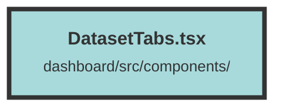

# DatasetTabs.tsx

### Purpose
The `DatasetTabs` component is designed to provide navigation tabs for different sections of a dataset within a dashboard. It dynamically generates links based on the dataset's ID, allowing users to switch between the "Start", "Events", and "Settings" sections.

### Flow
1. **Import Statements**: The component imports `A` and `useParams` from `@solidjs/router`.
2. **useParams Hook**: The `useParams` hook is used to extract URL parameters, specifically the dataset ID.
3. **Return Statement**: The component returns a `div` containing three `A` elements, each representing a tab.
   - **Tab Links**: Each `A` element constructs a URL using the dataset ID from `useParams`.
   - **Styling**: The `activeClass` and `class` attributes are used to style the tabs, including hover effects and active state styling.

The component ensures that the correct dataset ID is included in the URLs, enabling seamless navigation between different sections of the dataset.

##### Auto generated documentation file from CodeViz.ai
