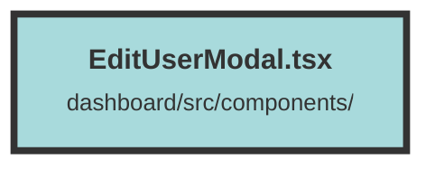

# EditUserModal.tsx

### Purpose
The `EditUserModal` component is designed to allow administrators to edit the role of a user within an organization. It provides a modal interface where the current role of the user can be viewed and updated.

### Flow
1. **Imports and Context Setup**: The component imports necessary hooks and components from `solid-js` and `terracotta`, as well as context and types from local files. It uses the `UserContext` to access user-related data.

2. **State Initialization**: The component initializes a signal `role` to manage the user's role state.

3. **Effects and Memos**:
   - `createEffect` sets the initial role of the user being edited.
   - `currentUserRole` and `editingUserRole` memos determine the roles of the current user and the user being edited, respectively.

4. **Invite User Function**: The `inviteUser` function sends a PUT request to update the user's role on the server. It handles success and error responses by either closing the modal or showing a toast notification.

5. **Modal Rendering**:
   - The modal is conditionally rendered using the `Show` component.
   - The modal contains a form with a dropdown to select the new role for the user.
   - The form submission triggers the `inviteUser` function.
   - Buttons are provided to cancel the operation or submit the role change.

6. **Role Selection**: The dropdown options are dynamically shown or hidden based on the current user's role, ensuring that users can only assign roles up to their own level.

##### Auto generated documentation file from CodeViz.ai
