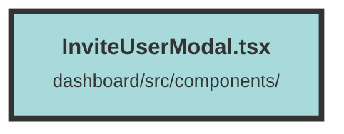

# InviteUserModal.tsx


### Purpose
The `InviteUserModal` component is designed to provide a user interface for inviting new users to an organization. It allows the current user to input an email address and select a role for the new user, then sends an invitation via an API call.

### Flow
1. **Imports and Context Setup**: The component imports necessary modules and context, including Solid.js hooks, UI components from `terracotta`, and user context from `UserContext`.

2. **State Management**: It uses `createSignal` to manage local state for email, sending status, and user role.

3. **API Host**: The API host URL is retrieved from environment variables.

4. **Invite User Function**: 
   - Sets `sendingEmail` to `true`.
   - Sends a POST request to the `/invitation` endpoint with the email, role, and organization ID.
   - Handles the response: 
     - On success, closes the modal and shows a success toast.
     - On failure, shows an error toast with the message from the response.

5. **Modal UI**: 
   - Uses `Show` to conditionally render the modal based on `isOpen`.
   - Contains a form with fields for email and role, and buttons for submitting the form or canceling the action.
   - The form submission triggers the `inviteUser` function.

6. **Form Elements**: 
   - Email input field updates the `email` state.
   - Role dropdown updates the `role` state.
   - Submit button is disabled if the email is empty or an invitation is being sent.

7. **Styling and Accessibility**: 
   - Uses classes for styling and ensures accessibility with appropriate labels and focus outlines.
```

##### Auto generated documentation file from CodeViz.ai
