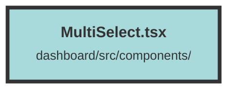

# MultiSelect.tsx

### Purpose
The `MultiSelect` component provides a user interface element for selecting multiple items from a list. It is designed to be used in scenarios where users need to choose multiple options from a predefined set of items.

### Flow
1. **Imports**: The component imports necessary icons, types, and functions from various libraries including `solid-icons`, `solid-js`, and `terracotta`.

2. **Component Definition**: The `MultiSelect` function component accepts `items` and `setSelected` as props. `items` is an array of objects with `id` and `name` properties, and `setSelected` is a callback function to handle the selected items.

3. **State Management**: 
   - `createSignal` is used to manage the state of selected items.
   - The `setSelected` function updates the local state and calls the `setSelected` prop to propagate the changes.

4. **Rendering**:
   - The component renders a `div` containing a label and a `Listbox` component.
   - The `Listbox` is configured to allow multiple selections and is initially closed.
   - The `ListboxButton` displays the selected items or a fallback message if no items are selected.
   - The `DisclosureStateChild` component conditionally renders the `ListboxOptions` based on the open state.
   - Each `ListboxOption` represents an item from the `props.items` array and updates its appearance based on whether it is selected.

5. **Styling and Interaction**:
   - The component uses various CSS classes for styling, including classes for hover and focus states.
   - Icons from `solid-icons` are used to enhance the user interface, such as the `TbSelector` for the dropdown indicator and `AiOutlineCheck` for selected items.

##### Auto generated documentation file from CodeViz.ai
