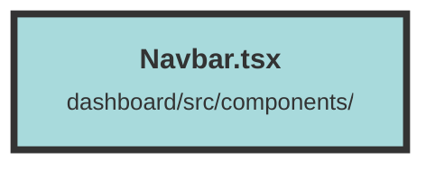

# Navbar.tsx

### Purpose
The `NavBar` component provides a navigation bar for the application, including links to the dashboard and a popover for help or contact options.

### Flow
1. **Imports**: The file imports necessary modules and components from various libraries such as `solid-js`, `solid-icons`, `terracotta`, and `@solidjs/router`.
2. **Context and Navigation**: It uses `useContext` to access the `UserContext` and `useNavigate` for navigation.
3. **Component Structure**: 
   - The main `div` contains two sections: a link to the dashboard and a help/contact popover.
   - The dashboard link includes an image (logo) and a text span. Clicking the image navigates to the dashboard.
4. **Popover**: 
   - The `Popover` component contains a button (`PopoverButton`) and a panel (`PopoverPanel`).
   - The button toggles the visibility of the panel.
   - The panel provides help and contact options, including email, Matrix server, GitHub issues, and Discord server links.

##### Auto generated documentation file from CodeViz.ai
