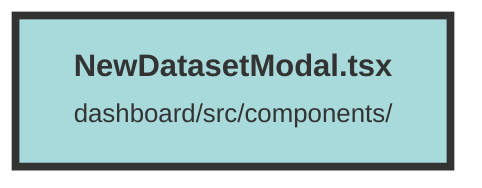

# NewDatasetModal.tsx

### Purpose
The `NewDatasetModal` component is designed to provide a user interface for creating a new dataset within an organization. It allows users to input necessary details such as the dataset name and select an embedding model, then submit this information to create the dataset on the server.

### Flow
1. **Imports and Context Setup**: The component imports necessary libraries and context, including Solid.js hooks, UI components from `terracotta`, and user context from `UserContext`.

2. **Component Props**: The `NewDatasetModal` component accepts `isOpen` and `closeModal` as props to control the modal's visibility.

3. **State Management**: 
   - `serverConfig` is initialized with default server configurations.
   - `name` is used to store the dataset name input by the user.
   - `selectedOrgnaization` is a memoized value that retrieves the selected organization from the user context.

4. **Dataset Creation Function**: 
   - `createDataset` function constructs a POST request to the server with the dataset details.
   - It handles the server response, showing success or error toasts based on the outcome.
   - On success, it navigates to the newly created dataset's page.

5. **Modal Structure**: 
   - The modal uses `Transition` and `Dialog` components for animations and structure.
   - It contains a form with fields for organization, dataset name, and embedding model selection.
   - The form submission triggers the `createDataset` function.

6. **Form Elements**:
   - **Organization**: Displays the selected organization.
   - **Dataset Name**: Input field for the dataset name.
   - **Embedding Model**: Dropdown to select an embedding model, updating `serverConfig` based on the selection.

7. **Buttons**:
   - **Cancel**: Closes the modal without creating a dataset.
   - **Create New Dataset**: Submits the form to create the dataset, disabled if the dataset name is empty.

##### Auto generated documentation file from CodeViz.ai
