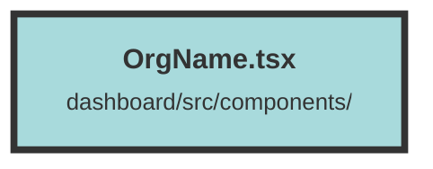

# OrgName.tsx

### Purpose
The purpose of this file is to define a React component named `OrgName` that displays the name of the currently selected organization for a user.

### Flow
1. **Context Usage**: The component uses the `useContext` hook to access the `UserContext`, which contains user-related data.
2. **Memoization**: The `createMemo` function is used to create a memoized value `selectedOrganization`. This value is computed by:
   - Retrieving the `selectedOrganizationId` from the `userContext`.
   - Finding the organization in the user's list of organizations that matches the `selectedOrganizationId`.
3. **Rendering**: The component returns an `<h3>` element that displays the name of the selected organization followed by the word "Organization". The text is styled with specific CSS classes for font size, weight, and color.

##### Auto generated documentation file from CodeViz.ai
