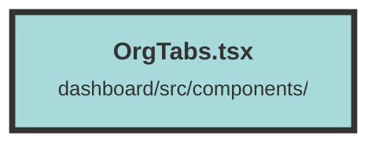

# OrgTabs.tsx

### Purpose
The `OrgTabs` component is designed to provide navigation tabs for different sections of an organization's dashboard. It dynamically generates links based on the currently selected organization, allowing users to switch between various sections such as Overview, Users, Billing, and Settings.

### Flow
1. **Context Usage**: The component uses the `UserContext` to access the `selectedOrganizationId`.
2. **Dynamic Links**: It creates navigation links (`<A>` components from `@solidjs/router`) for different sections of the dashboard. Each link's `href` attribute is dynamically constructed using the `selectedOrganizationId`.
3. **Styling**: Each link has an `activeClass` for styling the active tab and a `hover` class for hover effects.
4. **Rendering**: The links are rendered within a `div` with a flexbox layout to display them horizontally with space between them.

##### Auto generated documentation file from CodeViz.ai
