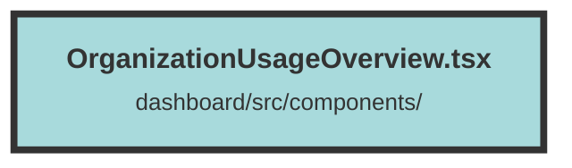

# OrganizationUsageOverview.tsx


### Purpose
The `OrganizationUsageOverview` component provides a summary of an organization's usage statistics, including total users, file storage, message count, and chunk count. It compares the current usage against the organization's plan limits.

### Flow
1. **Imports and Props Definition**:
   - Imports necessary types and functions from `solid-js` and local `apiTypes`.
   - Defines the `OrganizationUsageOverviewProps` interface, which includes two accessors: `organization` and `orgUsage`.

2. **Component Structure**:
   - The `OrganizationUsageOverview` functional component takes `props` of type `OrganizationUsageOverviewProps`.
   - Returns a `div` containing a grid layout with four sections, each displaying a different usage metric.

3. **Usage Metrics**:
   - Each section (`<div class="px-4 py-5 sm:p-6">`) contains:
     - A title (`<dt class="text-base font-normal">`).
     - A value (`<dd class="mt-1 flex items-baseline justify-between md:block lg:flex">`) showing the current usage and the plan limit.
   - The values are dynamically populated using the `props.orgUsage()` and `props.organization()?.plan` accessors.

4. **Styling**:
   - Utilizes Tailwind CSS classes for styling, ensuring a responsive and visually appealing layout.
```

##### Auto generated documentation file from CodeViz.ai
