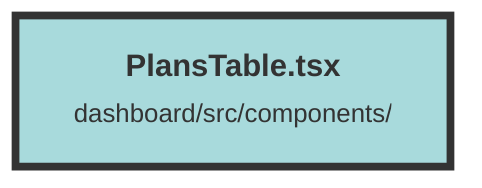

# PlansTable.tsx

### Purpose
The `PlansTable` component is designed to display and manage subscription plans for an organization. It allows users to view available plans, see their current subscription details, and change or cancel their subscription plans.

### Flow
1. **Initialization**:
   - Imports necessary modules and types.
   - Defines the `PlansTableProps` interface for component props.
   - Defines the `activeTag` function to create a styled tag element.

2. **Component Setup**:
   - The `PlansTable` component initializes several state signals using `createSignal` to manage available plans, current plan, current subscription, processing state, and canceling state.

3. **Effects**:
   - `createEffect` to update the current plan and subscription based on `props.currentOrgSubPlan`.
   - `createEffect` to fetch available plans from the API and update the state. It also handles cleanup using `onCleanup`.

4. **Memoized Data**:
   - `availablePlansWithCurrent` memo to combine available plans with the current plan and subscription details.

5. **Helper Functions**:
   - `refetchOrgSubPlan`: Refetches the organization subscription plan details from the API.
   - `cancelPlan`: Cancels the current subscription plan and updates the state.
   - `updatePlan`: Updates the subscription plan to a new plan and updates the state.

6. **Rendering**:
   - Renders a grid with enterprise plan details.
   - Displays a notice if the current subscription is ending soon.
   - Renders a table of available plans with details and action buttons for subscribing, upgrading, or downgrading plans.

##### Auto generated documentation file from CodeViz.ai
