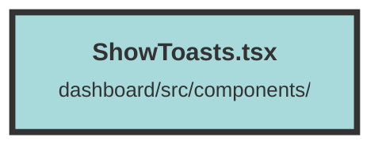

# ShowToasts.tsx

### Purpose
The file provides a mechanism to display toast notifications in a Solid.js application. It includes the `createToast` function to trigger toast events and the `ShowToasts` component to render the toasts.

### Flow
1. **ToastDetail and ToastEvent Interfaces**: Define the structure for toast details and events.
2. **createToast Function**: Dispatches a custom event (`show-toast`) with toast details.
3. **ShowToasts Component**:
   - **State Management**: Uses `createSignal` to manage the list of active toasts.
   - **Effect Hook**: Listens for `show-toast` events and updates the toast list. Sets a timeout to remove the toast after a specified duration.
   - **Event Cleanup**: Removes the event listener and clears the timeout on component cleanup.
   - **Rendering**: Displays toasts with appropriate icons and styles based on the toast type. Allows manual dismissal of toasts via a close icon.

##### Auto generated documentation file from CodeViz.ai
