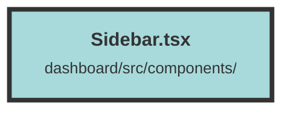

# Sidebar.tsx

### Purpose
The `Sidebar` component provides a navigational sidebar for a dashboard application. It allows users to switch between different organizations, access admin tools, and manage their session, including logging out.

### Flow
1. **Imports and Contexts**: The file imports necessary modules and contexts, including `UserContext` and `DatasetContext`, to manage user and dataset information.
2. **Environment Variables**: It retrieves API host and UI URLs from environment variables.
3. **State Management**: Uses Solid.js signals and memos to manage state, such as the visibility of the "Create New Organization" modal and the list of organizations.
4. **Organization List**: Displays a list of organizations. Clicking an organization sets it as the selected organization and navigates to its overview page.
5. **Admin Tools**: Provides links to search and chat tools, dynamically constructed using the selected organization and dataset IDs.
6. **User Info and Logout**: Shows the user's email and provides a logout button. The logout button triggers an API call to log the user out and redirect them to the logout URL.
7. **Modal**: Includes a modal component for creating a new organization, which is shown or hidden based on the state.

##### Auto generated documentation file from CodeViz.ai
