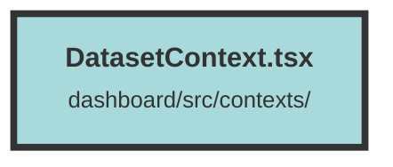

# DatasetContext.tsx

### Purpose
The purpose of this file is to create a context for managing and providing access to dataset information within a Solid.js application. It fetches dataset data from an API and makes it available to any component that consumes this context.

### Flow
1. **Imports**: The file imports necessary functions and types from Solid.js, as well as custom types and components.
2. **Interfaces**: Defines `DatasetStoreContextProps` for the context provider's props and `DatasetStore` for the context value.
3. **Context Creation**: Creates a `DatasetContext` with an initial value of `null` for the dataset.
4. **Context Wrapper Component**:
   - Uses `useContext` to access the `UserContext`.
   - Initializes a signal `dataset` to hold the dataset data.
   - Uses `createEffect` to fetch dataset data when the user is available and the dataset ID is present in the URL parameters.
   - Fetches data from the API and updates the `dataset` signal.
   - Handles errors by displaying a toast notification.
5. **Provider**: Wraps the children components with `DatasetContext.Provider`, passing the `datasetStore` as the context value.

##### Auto generated documentation file from CodeViz.ai
