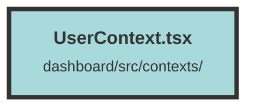

# UserContext.tsx

### Purpose
The purpose of this file is to create a user context for managing user authentication and organization selection within a Solid.js application. It provides a context wrapper component that handles user login, organization selection, and exposes user-related state and functions to the rest of the application.

### Flow
1. **Imports and Interfaces**: The file imports necessary functions from Solid.js and defines interfaces for `UserStoreContextProps`, `Notification`, and `UserStore`.

2. **Context Creation**: A `UserContext` is created using `createContext` with default values for user state and functions.

3. **UserContextWrapper Component**:
   - **State Initialization**: Signals for `user` and `selectedOrganizationId` are created using `createSignal`.
   - **Login Function**: Defines a `login` function that fetches user data from the API and updates the `user` signal. If unauthorized, it redirects to the login page.
   - **Effect for Organization Selection**: A `createEffect` is used to determine the selected organization based on the URL path or user organizations and triggers the `login` function if the organization changes.
   - **Initial Login Effect**: Another `createEffect` ensures the `login` function is called when the component mounts.
   - **UserStore Object**: Combines the state and functions into a `userStore` object.
   - **Context Provider**: Returns a `UserContext.Provider` that passes the `userStore` to its children.

This setup allows any component within the `UserContextWrapper` to access and manipulate user and organization data.

##### Auto generated documentation file from CodeViz.ai
