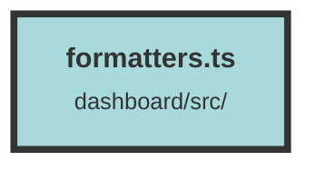

# formatters.ts


### Purpose
This file provides utility functions for formatting numbers, bytes, and dates in a consistent manner. It includes formatters for currency, general numbers, byte sizes, and dates.

### Flow
1. **Currency Formatter**: 
   - `usdFormatter` uses `Intl.NumberFormat` to format numbers as USD currency.
   ```javascript
   export const usdFormatter = new Intl.NumberFormat("en-US", {
     style: "currency",
     currency: "USD",
   });
   ```

2. **Byte Size Formatter**: 
   - `formatBytesDecimal` converts bytes to a human-readable string in either MB or GB, depending on the size.
   ```javascript
   export const formatBytesDecimal = (bytes: number, dm = 2) => {
     if (bytes == 0) return "0 Bytes";
     if (bytes > 1e8) {
       return (bytes / 1e9).toFixed(dm) + " GB";
     }
     return (bytes / 1e6).toFixed(dm) + " MB";
   };
   ```

3. **Number Formatter**: 
   - `numberFormatter` uses `Intl.NumberFormat` to format general numbers according to US conventions.
   ```javascript
   export const numberFormatter = new Intl.NumberFormat("en-US");
   ```

4. **Date Formatter**: 
   - `formatDate` uses `Intl.DateTimeFormat` to format dates according to US conventions.
   ```javascript
   export const formatDate = (date: Date) =>
     new Intl.DateTimeFormat("en-US").format(date);
   ```

##### Auto generated documentation file from CodeViz.ai
