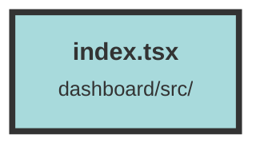

# index.tsx

### Purpose
This file serves as the main entry point for a Solid.js web application. It sets up routing, initializes Sentry for error tracking in production, and renders the application to the DOM.

### Flow
1. **Imports**: The file imports necessary styles, libraries, and components, including Solid.js, Sentry, and various layout and page components.
2. **Sentry Initialization**: If the application is not in development mode (`!DEV`), Sentry is initialized with specific configurations for error tracking and performance monitoring.
3. **Root Element**: The root DOM element is selected using `document.getElementById("root")`.
4. **Rendering**: The `render` function from Solid.js is used to render the application. The application is wrapped in a `Router` component to handle client-side routing.
5. **Routes**: Various routes are defined using the `Route` component:
   - The root path (`"/"`) renders the `Home` component.
   - Nested routes under `"/dashboard/dataset/:id"` render components like `DatasetLayout`, `DatasetStart`, `DatasetSettingsPage`, and `DatasetEvents`.
   - Routes under `"/dashboard"` render the `DashboardLayout` and other components like `Overview`, `UserManagement`, `Billing`, and `Settings`.

##### Auto generated documentation file from CodeViz.ai
