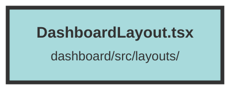

# DashboardLayout.tsx

### Purpose
The `DashboardLayout` component serves as the main layout for the dashboard section of the application. It manages navigation, user role-based access control, and displays the appropriate content based on the user's organization and role.

### Flow
1. **Imports and Context Setup**:
   - Imports necessary modules and components.
   - Retrieves `userContext`, `location`, and `navigate` using hooks.

2. **Effect for Navigation**:
   - Uses `createEffect` to monitor changes in the URL path.
   - Redirects to the appropriate dashboard overview page if the path matches certain conditions.
   - Ensures the URL structure is correct by appending `/overview` if necessary.

3. **User Role Memoization**:
   - Uses `createMemo` to compute the current user's role within the selected organization.

4. **Component Rendering**:
   - Displays `ShowToasts` for notifications.
   - Renders the layout with a `NavBar` and `Sidebar`.
   - Uses `Switch` and `Match` to conditionally render content based on the user's organization membership and role:
     - If the user is not part of any organization, a message is displayed.
     - If the user lacks sufficient permissions, an access denied message is shown.
     - If the user has the necessary permissions, the organization name, tabs, and children components are rendered.

##### Auto generated documentation file from CodeViz.ai
