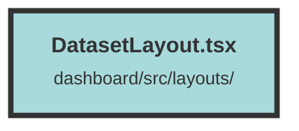

# DatasetLayout.tsx

### Purpose
The `DatasetLayout` component serves as a layout wrapper for dataset-related pages in the application. It ensures a consistent structure and navigation experience across these pages.

### Flow
1. **Imports**: The file imports necessary components and hooks from Solid.js and other local components.
2. **Props Interface**: Defines `DatasetLayoutProps` to optionally accept `children` of type `JSX.Element`.
3. **Component Definition**: The `DatasetLayout` component is defined, utilizing `useLocation` and `useNavigate` hooks.
4. **Effect Hook**: A `createEffect` hook monitors the current pathname. If the pathname has exactly four sections, it navigates to a sub-path `/start` and replaces the current history entry.
5. **Return Statement**: The component returns a JSX structure:
   - **ShowToasts**: Displays toast notifications.
   - **Main Layout**: A flex container with a white background and black text.
     - **NavBar**: A navigation bar at the top.
     - **Sidebar and Main Content**: A flex container with a sidebar and main content area.
       - **DatasetName and DatasetTabs**: Display dataset name and tabs.
       - **Children**: Renders any child components passed to `DatasetLayout`.

##### Auto generated documentation file from CodeViz.ai
