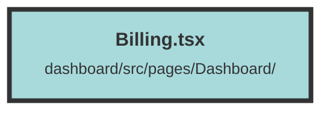

# Billing.tsx

### Purpose
The `Billing` component is designed to manage and display billing information for the selected organization. It fetches the subscription plan details of the organization and displays them using the `PlansTable` component.

### Flow
1. **Imports and Context Setup**:
   - Imports necessary functions from `solid-js` and other components.
   - Retrieves the `UserContext` to access user and organization data.

2. **State Initialization**:
   - Initializes `orgSubPlan` signal to store the organization subscription plan details.
   - Defines a memoized `selectedOrganization` to get the currently selected organization based on the user's context.

3. **Effect for Fetching Data**:
   - Uses `createEffect` to fetch the subscription plan details when the selected organization changes.
   - Makes a fetch request to the API endpoint using the selected organization's ID.
   - Handles potential errors by showing a toast notification if the user needs to re-authenticate.
   - Updates the `orgSubPlan` signal with the fetched data.

4. **Cleanup**:
   - Aborts the fetch request if the component is unmounted or the effect is re-triggered.

5. **Rendering**:
   - Renders the `PlansTable` component, passing the current organization subscription plan as a prop.

##### Auto generated documentation file from CodeViz.ai
