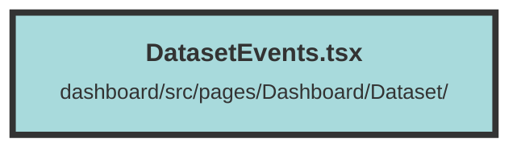

# DatasetEvents.tsx

### Purpose
The `DatasetEvents` component is designed to fetch and display a list of events related to dataset operations from a server. It allows users to filter events by type and automatically refreshes the event list every 5 seconds.

### Flow
1. **Initialization**: The component initializes several state signals using `createSignal` to manage events, pagination, loading state, selected filters, and chevron visibility.
2. **Context Usage**: It uses the `DatasetContext` to get the current dataset ID.
3. **Fetching Events**: The `getEvents` function fetches events from the server based on the selected filters and current page. It updates the events list and pagination count if the response is valid.
4. **Auto-Refresh**: An interval is set up to call `getEvents` every 5 seconds, ensuring the event list is up-to-date. This interval is cleared when the component unmounts using `onCleanup`.
5. **Effect Hook**: `createEffect` is used to fetch events initially when the component mounts.
6. **Rendering**: The component renders a main section with:
   - An informational message.
   - A `MultiSelect` component for filtering events.
   - A table displaying the events with columns for level, event type, time, and metadata.
   - Pagination controls to navigate through pages of events.
7. **Event Table**: Each event row can expand to show full metadata if it overflows, controlled by a chevron button.

##### Auto generated documentation file from CodeViz.ai
