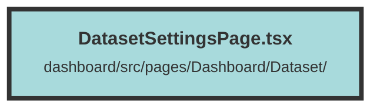

# DatasetSettingsPage.tsx

### Purpose
This file defines the settings forms for a dataset management application. It includes forms for configuring frontend and server settings, as well as a "Danger Zone" section for advanced operations like deleting a dataset.

### Flow
1. **Default Configurations**: The file starts by defining default configurations for both client and server environments (`defaultClientEnvsConfiguration` and `defaultServerEnvsConfiguration`).

2. **FrontendSettingsForm Component**:
   - Uses `useContext` to access `DatasetContext` and `UserContext`.
   - Initializes state for client configuration and dataset name using `createSignal`.
   - Uses `createEffect` to update state when the context changes.
   - Defines an `onSave` function to save the updated settings via a `PUT` request.
   - Renders a form with input fields for various frontend settings and a save button.

3. **ServerSettingsForm Component**:
   - Similar to `FrontendSettingsForm`, it uses `useContext` to access `DatasetContext`.
   - Initializes state for server configuration using `createSignal`.
   - Uses `createEffect` to update state when the context changes.
   - Defines an `onSave` function to save the updated server settings via a `PUT` request.
   - Renders a form with input fields for various server settings and a save button.

4. **DangerZoneForm Component**:
   - Uses `useContext` to access `DatasetContext`.
   - Defines a `deleteDataset` function to delete the dataset via a `DELETE` request.
   - Renders a form with a delete button that triggers the `deleteDataset` function.

5. **DatasetSettingsPage Component**:
   - Combines the `ServerSettingsForm`, `FrontendSettingsForm`, and `DangerZoneForm` components into a single page layout.

##### Auto generated documentation file from CodeViz.ai
